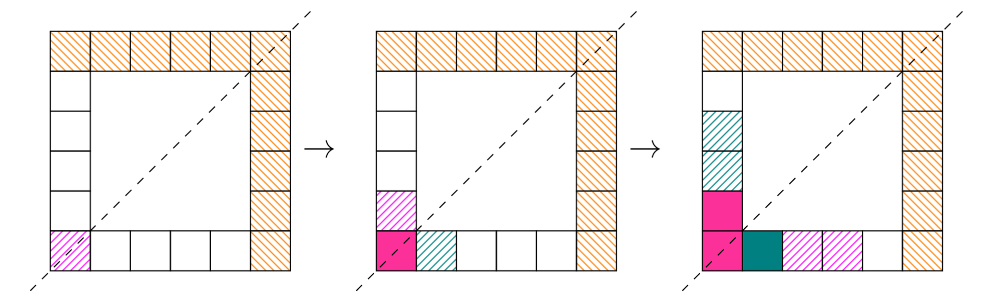

# Bundeswettbewerb Mathematik 2025 - Runde 1

zusammen mit henry :3

[Link zum PDF mit Aufgaben (https://www.mathe-wettbewerbe.de/)](https://www.mathe-wettbewerbe.de/fileadmin/Mathe-Wettbewerbe/Bundeswettbewerb_Mathematik/Dokumente/Aufgaben_und_Loesungen_BWM/2025/BWM_2025_Aufgabenblatt_SCREEN.pdf)

[Link zum PDF mit unseren Lösungen](final_submission.pdf) (Stand 03.03.2025, also so wie es eingereicht wurde) Wird nicht mehr neugeneriert, wenn Änderungen an `bwm.tex` gemacht werden, die neue Version muss jeder selbst kompilieren

[Link zum PDF mit offiziellen Lösungen (https://www.mathe-wettbewerbe.de/)](https://www.mathe-wettbewerbe.de/fileadmin/Mathe-Wettbewerbe/Bundeswettbewerb_Mathematik/Dokumente/Aufgaben_und_Loesungen_BWM/2025/bwm_2025_i_version_homepage_2_2025_03_16.pdf) (Keine Ahnung seit wann die online sind, irgendwas Ende April)

## Potentielle Punktabzüge/Vergleich zu Lösungen

(In Bezug auf die [abgegebene Version](final_submission.pdf), ich versuche momentan diese Fehler nachzuholen)

✔️ = Problem (immerhin) nachbearbeitet, 〰️ = meh, ❌ = nicht

✔️ = Perfekt richtig, 〰️ = vmtl. Punktabzüge, ❌ = Nicht fertig (3 Aufgaben müssen richtig sein, um in 2. Runde zu kommen, mal sehen :P)

|Aufgabe|Probleme|Richtig?|
|-|-|-|
|A1|-|✔️|
|A2|<ul><li>❌ aus den beiden iterativen Mustern von 2^m und n!/(5m)! lässt sich nicht unbedingt folgern, dass die Reihe an LZ(n!) auch alle Ziffern unendlich oft hat</li></ul>|️❌ Unvollständig :(|
|A3|<ul><li>〰️ unerklärt, warum MC und ME die Winkelhalbierenden ihrer Halbkreissektoren sind</li><li>✔️ keine Erklärung für sqrt(cos^2(a)) = cos(a)</li></ul>|〰️|
|A4|-|✔️|

## Struktur

- `./bwm`: `.tex`-Dateien und all die anderen auxfiles die im `.gitignore` stehen
- `./henry`: Lösungen, die Henry mir geschickt hat
- `./img`: Bilder für dieses README
- `./python`: Python scripts zum Überprüfen der Beweise unserer Lösungen

## Bilder

Ich hab dieses Projekt ausgenutzt um auch ein bisschen LaTeX zu lernen :)

Formeln:  

Tabellen:  

Wunderschöne geometrische Skizzen:  

Und noch mehr wunderschöne Diagramme:  
