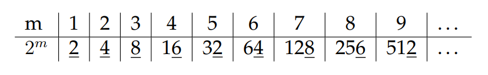

# Bundeswettbewerb Mathematik 2025 - Runde 1

zusammen mit henry :3

[Link zum PDF mit unseren Lösungen](final.pdf) (so wie es eingereicht wurde, wird nicht mehr neugeneriert, falls irgendwelche Änderungen an `bwm.tex` gemacht werden)

## Struktur

- `./bwm`: `.tex`-Datei und all die anderen aux files die im `.gitignore` stehen
- `./henry`: Lösungen, die Henry mir geschickt hat
- `./img`: Bilder für dieses README
- `./python`: Python files (nur eine, hätten ja auch noch mehr werden können)

## Bilder

Ich hab dieses Projekt ausgenutzt um auch ein bisschen LaTeX zu lernen :)

Formeln:  

Tabellen:  

Wunderschöne geometrische Skizzen:  

Und noch mehr wunderschöne Diagramme:  
